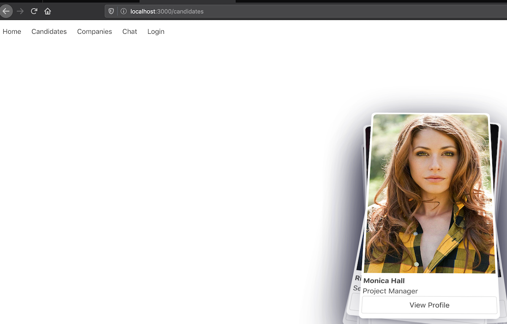

# One-App


This is the helm-chart for [One App](https://github.com/Americanexpress/one-app) you can run this demo with:

`kind create cluster`

`helm install . --generate-name -f example-local-values.yaml`

_On a Kubernetes cluster_



_Pod log_

```
│ {"schemaVersion":"0.3.0","application":{"name":"One App","version":"5.0.0-rc1-51e22d6f"},"device":{"id":"chart-1582721815-one-app-84d9fccd6-bv8gn:1","agent":"Linux │
│  x64"},"level":"info","timestamp":"2020-02-26T13:12:40.570Z","request":{"direction":"in","protocol":"http","address":{"uri":"http://10.244.0.13/"},"metaData":{"use │
│ rId":null,"method":"GET","correlationId":"16d1fd8a-3d8e-4730-bb42-c67dea8dfdf9","host":"10.244.0.13:3000","referrer":null,"userAgent":"kube-probe/1.17","forwarded" │
│ :null,"forwardedFor":null,"locale":"*"},"timings":{"duration":8,"ttfb":6},"statusCode":200,"statusText":"OK"}}                                                      │
│ {"schemaVersion":"0.3.0","application":{"name":"One App","version":"5.0.0-rc1-51e22d6f"},"device":{"id":"chart-1582721815-one-app-84d9fccd6-bv8gn:1","agent":"Linux │
│  x64"},"level":"info","timestamp":"2020-02-26T13:12:43.468Z","message":"sendHtml, have store? true, have appHtml? true"}                                            │
│ {"schemaVersion":"0.3.0","application":{"name":"One App","version":"5.0.0-rc1-51e22d6f"},"device":{"id":"chart-1582721815-one-app-84d9fccd6-bv8gn:1","agent":"Linux │
│  x64"},"level":"info","timestamp":"2020-02-26T13:12:43.470Z","request":{"direction":"in","protocol":"http","address":{"uri":"http://10.244.0.13/"},"metaData":{"use │
│ rId":null,"method":"GET","correlationId":"49fdfdd1-978a-43b8-a7f1-9ec81244e1e7","host":"10.244.0.13:3000","referrer":null,"userAgent":"kube-probe/1.17","forwarded" │
│ :null,"forwardedFor":null,"locale":"*"},"timings":{"duration":5,"ttfb":4},"statusCode":200,"statusText":"OK"}}                                                      │
│ {"schemaVersion":"0.3.0","application":{"name":"One App","version":"5.0.0-rc1-51e22d6f"},"device":{"id":"chart-1582721815-one-app-84d9fccd6-bv8gn:1","agent":"Linux │
│  x64"},"level":"info","timestamp":"2020-02-26T13:12:43.470Z","request":{"direction":"in","protocol":"http","address":{"uri":"http://10.244.0.13/"},"metaData":{"use │
│ rId":null,"method":"GET","correlationId":"49fdfdd1-978a-43b8-a7f1-9ec81244e1e7","host":"10.244.0.13:3000","referrer":null,"userAgent":"kube-probe/1.17","forwarded" │
│ :null,"forwardedFor":null,"locale":"*"},"timings":{"duration":5,"ttfb":4},"statusCode":200,"statusText":"OK"}}                                                      │
│ {"schemaVersion":"0.3.0","application":{"name":"One App","version":"5.0.0-rc1-51e22d6f"},"device":{"id":"chart-1582721815-one-app-84d9fccd6-bv8gn:1","agent":"Linux │
│  x64"},"level":"info","timestamp":"2020-02-26T13:12:50.566Z","message":"sendHtml, have store? true, have appHtml? true"}                                            │
│ {"schemaVersion":"0.3.0","application":{"name":"One App","version":"5.0.0-rc1-51e22d6f"},"device":{"id":"chart-1582721815-one-app-84d9fccd6-bv8gn:1","agent":"Linux │
│  x64"},"level":"info","timestamp":"2020-02-26T13:12:50.570Z","request":{"direction":"in","protocol":"http","address":{"uri":"http://10.244.0.13/"},"metaData":{"use │
│ rId":null,"method":"GET","correlationId":"39b8cd27-cff4-4fa4-b442-76f4137eb6be","host":"10.244.0.13:3000","referrer":null,"userAgent":"kube-probe/1.17","forwarded" │
│ :null,"forwardedFor":null,"locale":"*"},"timings":{"duration":7,"ttfb":4},"statusCode":200,"statusText":"OK"}}                                                      │
│ {"schemaVersion":"0.3.0","application":{"name":"One App","version":"5.0.0-rc1-51e22d6f"},"device":{"id":"chart-1582721815-one-app-84d9fccd6-bv8gn:1","agent":"Linux │
│  x64"},"level":"info","timestamp":"2020-02-26T13:12:50.570Z","request":{"direction":"in","protocol":"http","address":{"uri":"http://10.244.0.13/"},"metaData":{"use │
│ rId":null,"method":"GET","correlationId":"39b8cd27-cff4-4fa4-b442-76f4137eb6be","host":"10.244.0.13:3000","referrer":null,"userAgent":"kube-probe/1.17","forwarded" │
│ :null,"forwardedFor":null,"locale":"*"},"timings":{"duration":7,"ttfb":5},"statusCode":200,"statusText":"OK"}}                                                      │
│
```


# Requirements

- [KIND](https://kind.sigs.k8s.io/docs/user/quick-start/)
- Docker
- Helm
